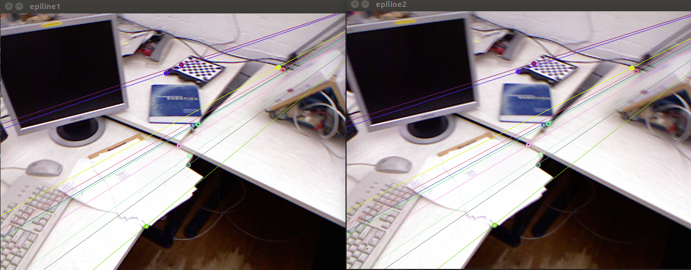

# 题目
## 现有一个运动着的相机拍摄的连续两张图片，其中特征点匹配部分已经完成。请根据两帧图像对应的匹配点计算基础矩阵，并利用该矩阵绘制出前10个特征点对应的极线。
### 参考结果是这样的：

```C++
/****************************
 * 题目：现有一个运动着的相机拍摄的连续两张图片，其中特征点匹配部分已经完成。
 * 请根据两帧图像对应的匹配点计算基础矩阵，并利用该矩阵绘制出前10个特征点对应的极线。
 *
* 本程序学习目标：
 * 理解掌握对极约束的原理
 * 熟悉OpenCV编程
 *
 * 公众号：计算机视觉life。发布于公众号旗下知识星球：从零开始学习SLAM
 * 时间：2018.11
****************************/
#include<iostream>
#include <vector>
#include <opencv2/core/core.hpp>
#include <opencv2/opencv.hpp>
#include <opencv2/highgui/highgui.hpp>
#include <opencv2/features2d/features2d.hpp>
#include <opencv2/calib3d/calib3d.hpp>

using namespace std;
using namespace cv;
int main( int argc, char** argv )
{

    Mat rgb1 = imread( "./rgb1.ppm");
    Mat rgb2 = imread( "./rgb2.ppm");

    Ptr<FeatureDetector> detector = ORB::create();
    Ptr<DescriptorExtractor> descriptor = ORB::create();

    vector< KeyPoint > kp1, kp2;
    detector->detect( rgb1, kp1 );
    detector->detect( rgb2, kp2 );

    // 计算描述子
    Mat desp1, desp2;
    descriptor->compute( rgb1, kp1, desp1 );
    descriptor->compute( rgb2, kp2, desp2 );

    // 匹配描述子
    vector< DMatch > matches;
    BFMatcher matcher;
    matcher.match( desp1, desp2, matches );
    cout<<"Find total "<<matches.size()<<" matches."<<endl;

    // 筛选匹配对
    vector< DMatch > goodMatches;
    double minDis = 9999;
    for ( size_t i=0; i<matches.size(); i++ )
    {
        if ( matches[i].distance < minDis )
            minDis = matches[i].distance;
    }

    for ( size_t i=0; i<matches.size(); i++ )
    {
        if (matches[i].distance < 10*minDis)
            goodMatches.push_back( matches[i] );
    }


    vector< Point2f > pts1, pts2;
    for (size_t i=0; i<goodMatches.size(); i++)
    {
        pts1.push_back(kp1[goodMatches[i].queryIdx].pt);
        pts2.push_back(kp2[goodMatches[i].trainIdx].pt);
    }

    // 请先计算基础矩阵并据此绘制出前10个匹配点对应的对极线，可以调用opencv函数
    // ----------- 开始你的代码 --------------//
    Mat F = findFundamentalMat(pts1, pts2, FM_8POINT);
    std::vector<Vec<float, 3>> epilines1, epilines2;
    //计算对应点的外极线epilines是一个三元组(a,b,c)，表示点在另一视图中对应的外极线ax+by+c=0;
    computeCorrespondEpilines(pts1, 1, F, epilines1);
    computeCorrespondEpilines(pts2, 2, F, epilines2);
    RNG rng;
    for (uint i = 0; i < 10; i++)
    {
        Scalar color = Scalar(rng(256), rng(256), rng(256));//随机产生颜色
        //在视图2中把关键点用圆圈画出来，然后再绘制在对应点处的外极线
        circle(rgb2, pts2[i], 3, color, 2);
        line(rgb2, Point(0, -epilines1[i][2] / epilines1[i][1]), Point(rgb2.cols, -(epilines1[i][2] + epilines1[i][0] * rgb2.cols) / epilines1[i][1]), color);
        //绘制外极线的时候，选择两个点，一个是x=0处的点，一个是x为图片宽度处
        circle(rgb1, pts1[i], 3, color, 2);
        line(rgb1, Point(0, -epilines2[i][2] / epilines2[i][1]), Point(rgb1.cols, -(epilines2[i][2] + epilines2[i][0] * rgb1.cols) / epilines2[i][1]), color);
    }
    // ----------- 结束你的代码 --------------//
    imshow("epiline1", rgb2);
    imshow("epiline2", rgb1);
    waitKey(0);
    return 0;
}
```
