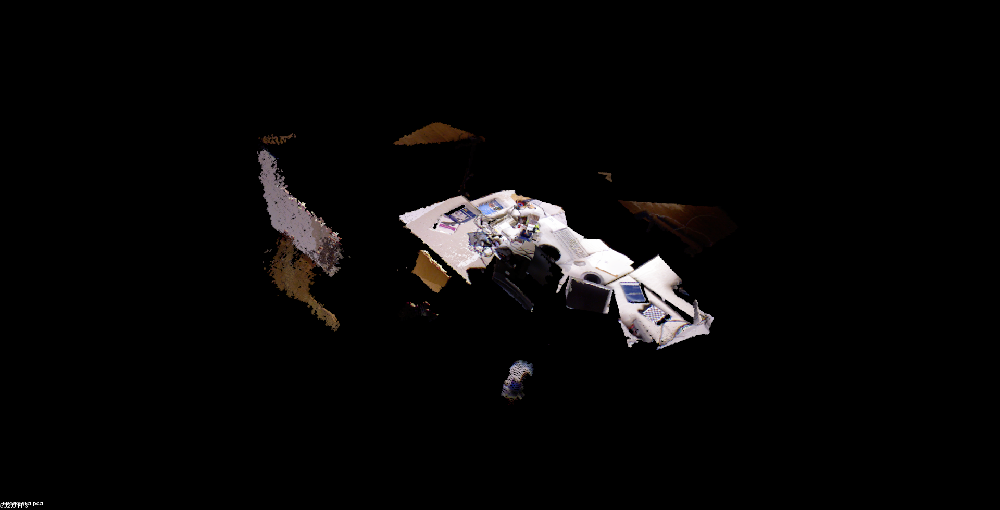

# 题目
## 点云融合实验。已经给定3帧（不连续）RGB-D相机拍摄的 RGB + depth 图像，以及他们之间的变换矩阵（以第一帧为参考帧），请将上述3帧RGB-D图像分别生成点云并融合出最终的点云输出。
### 练习目的：熟悉PCL的使用，熟悉RGB-D图像到点云的转换过程，掌握简单的点云融合方法。
### 如果不出意外，最终点云融合结果如下：

```C++
#include "slamBase.hpp"

PointCloud::Ptr image2PointCloud(Mat rgb, Mat depth, CAMERA_INTRINSIC_PARAMETERS camera)
{
    PointCloud::Ptr cloud ( new PointCloud );
    for (int m = 0; m < depth.rows; m++)
        for (int n = 0; n < depth.cols; n++)
        {
            // 获取深度图中(m,n)处的值
            ushort d = depth.ptr<ushort>(m)[n];
            // d 可能没有值，若如此，跳过此点
            if (d == 0)
                continue;
            // d 存在值，则向点云增加一个点
            PointT p;
            // 计算这个点的空间坐标
            p.z = double(d) / camera.scale;
            p.x = (n - camera.cx) * p.z / camera.fx;
            p.y = (m - camera.cy) * p.z / camera.fy;

            // 从rgb图像中获取它的颜色
            p.b = rgb.ptr<uchar>(m)[n * 3];
            p.g = rgb.ptr<uchar>(m)[n * 3 + 1];
            p.r = rgb.ptr<uchar>(m)[n * 3 + 2];

            // 把p加入到点云中
            cloud->points.push_back(p);
        }
    // 设置并保存点云
    cloud->height = 1;
    cloud->width = cloud->points.size();
    cloud->is_dense = false;
    return cloud;
}


PointCloud::Ptr pointCloudFusion( PointCloud::Ptr &original, FRAME& newFrame, Eigen::Isometry3d T, CAMERA_INTRINSIC_PARAMETERS camera )
{
	// ---------- 开始你的代码  ------------- -//
	// 简单的点云叠加融合
    PointCloud::Ptr newCloud(new PointCloud()), transCloud(new PointCloud());
    newCloud = image2PointCloud(newFrame.rgb, newFrame.depth, camera);
    pcl::transformPointCloud(*newCloud, *transCloud, T.matrix());
    *original += *transCloud;
    return original;
    // ---------- 结束你的代码  ------------- -//
}


void readCameraTrajectory(string camTransFile, vector<Eigen::Isometry3d> &poses)
{
    ifstream fcamTrans(camTransFile);
    if(!fcamTrans.is_open())
    {
        cerr << "trajectory is empty!" << endl;
        return;
    }

   	// ---------- 开始你的代码  ------------- -//
	// 参考作业8 绘制轨迹
    string lineData;
    while((getline(fcamTrans, lineData)) && !lineData.empty()) {
        Eigen::Quaterniond quad;
        Eigen::Vector3d t;
        Eigen::Isometry3d T = Eigen::Isometry3d::Identity();
        if (lineData[0] == '#') // 以‘＃’开头的是注释
        {
            continue;
        }
        istringstream strData(lineData);
        strData >> t[0] >> t[1] >> t[2] >> quad.x() >> quad.y() >> quad.z() >> quad.w();
        T.rotate(quad);
        T.pretranslate(t);
        poses.push_back(T);
    }
	// ---------- 结束你的代码  ------------- -//
}
```