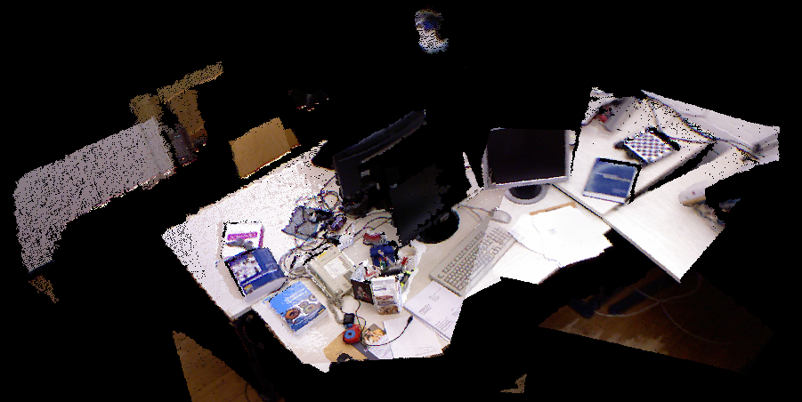
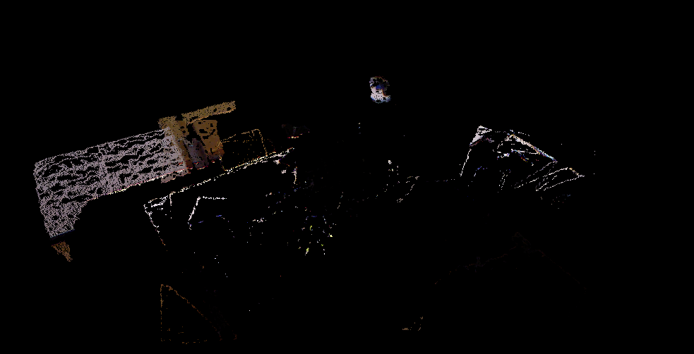
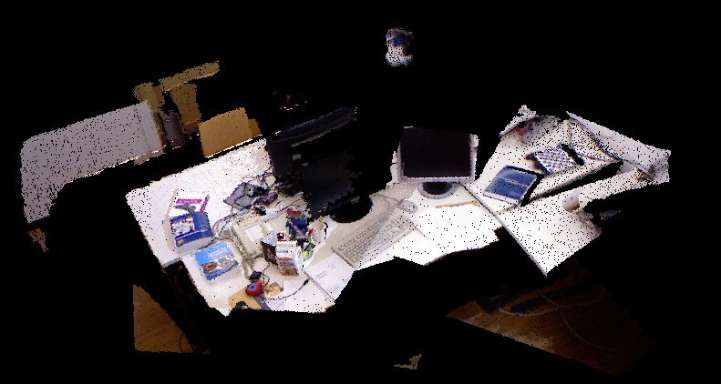

# 题目
## 给定一个融合后的点云，请先对其进行下采样，再进行滤波，最后输出滤波后的结果及被滤掉的离群点。



```C++
/****************************
 * 题目：给定一个融合后的点云（结果来自《从零开始一起学习SLAM | 你好，点云》），
 * 请先对其进行下采样，再进行滤波，最后输出滤波后的结果及被滤掉的离群点。
 *
* 本程序学习目标：
 * 熟悉PCL的滤波。
 *
 * 公众号：计算机视觉life。发布于公众号旗下知识星球：从零开始学习SLAM
 * 时间：2018.12
****************************/
#include <pcl/point_types.h>
#include <pcl/io/io.h>
#include <pcl/io/pcd_io.h>
#include <pcl/visualization/cloud_viewer.h>
#include <pcl/filters/radius_outlier_removal.h>
#include <pcl/filters/voxel_grid.h>
#include <pcl/filters/statistical_outlier_removal.h>

typedef pcl::PointXYZRGB PointT;

int main(int argc, char** argv)
{

	// 加载点云初始化
	pcl::PointCloud<PointT>::Ptr cloud(new pcl::PointCloud<PointT>);
    pcl::PointCloud<PointT>::Ptr cloud_downSampled(new pcl::PointCloud<PointT>);
	pcl::PointCloud<PointT>::Ptr cloud_filtered(new pcl::PointCloud<PointT>);
	pcl::PointCloud<PointT>::Ptr noise(new pcl::PointCloud<PointT>);
	if (pcl::io::loadPCDFile("./data/fusedCloud.pcd", *cloud) == -1)
    {
        cout << "点云数据读取失败！" << endl;
    }

    std::cout << "Points number before filtering: " << cloud->points.size() << std::endl;
	// ----------- 开始你的代码，参考http://docs.pointclouds.org/trunk/group__filters.html --------
    // 下采样，同时保持点云形状特征
    pcl::VoxelGrid<PointT> downSampled; //创建滤波对象
    downSampled.setInputCloud (cloud); //设置需要过滤的点云给滤波对象
    downSampled.setLeafSize (0.005f, 0.005f, 0.005f); //设置滤波时创建的体素体积为1cm的立方体
    downSampled.filter (*cloud_downSampled); //执行滤波处理，存储输出

	// 统计滤波
    pcl::StatisticalOutlierRemoval<PointT> statisOutlierRemoval; //创建滤波器对象
    statisOutlierRemoval.setInputCloud (cloud_downSampled); //设置待滤波的点云
    statisOutlierRemoval.setMeanK (50); //设置在进行统计时考虑查询点临近点数
    statisOutlierRemoval.setStddevMulThresh (1.0); //设置判断是否为离群点的阀值:均值+1.0*标准差
    statisOutlierRemoval.filter (*cloud_filtered); //滤波结果存储到cloud_filtered

    // 试试半径滤波效果
    // pcl::RadiusOutlierRemoval<PointT> ROutlierRemoval; //创建滤波器对象
    // ROutlierRemoval.setInputCloud(cloud_downSampled); //设置待滤波的点云
    // ROutlierRemoval.setRadiusSearch(0.02); // 设置搜索半径
    // ROutlierRemoval.setMinNeighborsInRadius(2); // 设置一个内点最少的邻居数目
    // ROutlierRemoval.filter(*cloud_filtered); //滤波结果存储到cloud_filtered

    std::cout << "Points number after filtering: " << cloud_filtered->points.size() << std::endl;
	
	// 输出内点
    pcl::PCDWriter writer;
    writer.write<PointT> ("./data/cloud_inliers.pcd", *cloud_filtered, false);
	// 输出离群点
    statisOutlierRemoval.setNegative (true);
    statisOutlierRemoval.filter (*noise);
    writer.write<PointT> ("./data/cloud_outliers.pcd", *noise, false);
	// ----------- 结束你的代码 --------
	
    // 显示滤波结果，或者用pcl_viewer 命令查看
    boost::shared_ptr<pcl::visualization::PCLVisualizer> viewer(new pcl::visualization::PCLVisualizer("3D Viewer"));
    viewer->setBackgroundColor(0, 0, 0);
    pcl::visualization::PointCloudColorHandlerRGBField<PointT> rgb(cloud_filtered);
    viewer->addPointCloud<PointT> (cloud_filtered, rgb, "sample cloud");
    while (!viewer->wasStopped())
    {
        viewer->spinOnce(100);
        boost::this_thread::sleep(boost::posix_time::microseconds(100000));
    }
	return (0);
}


```