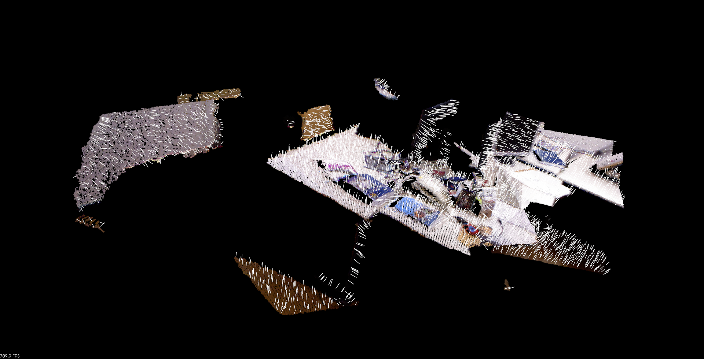

# 题目
## 给定一个融合后的点云，已经对其进行下采样和滤波（代码已给）。请对其进行平滑（输出结果），然后计算法线，并讲法线显示在平滑后的点云上。

```C++
/****************************
 * 题目：给定一个融合后的点云，已经对其进行下采样和滤波（代码已给）。
 * 请对其进行平滑（输出结果），然后计算法线，并讲法线显示在平滑后的点云上（提供截图）。
 *
* 本程序学习目标：
 * 熟悉PCL的平滑、法线计算、显示，为网格化做铺垫。
 *
 * 公众号：计算机视觉life。发布于公众号旗下知识星球：从零开始学习SLAM
 * 时间：2018.12
****************************/
#include <pcl/point_types.h>
#include <pcl/io/io.h>
#include <pcl/io/pcd_io.h>
#include <pcl/visualization/cloud_viewer.h>
#include <pcl/filters/radius_outlier_removal.h>
#include <pcl/filters/voxel_grid.h>
#include <pcl/filters/statistical_outlier_removal.h>
#include <pcl/surface/mls.h>
#include <pcl/features/normal_3d.h>

typedef pcl::PointXYZRGB PointT;

int main(int argc, char** argv)
{

	// Load input file
	pcl::PointCloud<PointT>::Ptr cloud(new pcl::PointCloud<PointT>);
    pcl::PointCloud<PointT>::Ptr cloud_downSampled(new pcl::PointCloud<PointT>);
	pcl::PointCloud<PointT>::Ptr cloud_filtered(new pcl::PointCloud<PointT>);
	pcl::PointCloud<PointT>::Ptr cloud_smoothed(new pcl::PointCloud<PointT>);
	if (pcl::io::loadPCDFile("./data/fusedCloud.pcd", *cloud) == -1)
    {
        cout << "点云数据读取失败！" << endl;
    }

    std::cout << "Orginal points number: " << cloud->points.size() << std::endl;

    // 下采样，同时保持点云形状特征
    pcl::VoxelGrid<PointT> downSampled;  //创建滤波对象
    downSampled.setInputCloud (cloud);            //设置需要过滤的点云给滤波对象
    downSampled.setLeafSize (0.01f, 0.01f, 0.01f);  //设置滤波时创建的体素体积为1cm的立方体
    downSampled.filter (*cloud_downSampled);           //执行滤波处理，存储输出

    pcl::io::savePCDFile ("./downsampledPC.pcd", *cloud_downSampled);

	// 统计滤波
	pcl::StatisticalOutlierRemoval<PointT> statisOutlierRemoval;       //创建滤波器对象
    statisOutlierRemoval.setInputCloud (cloud_downSampled);            //设置待滤波的点云
    statisOutlierRemoval.setMeanK (50);                                //设置在进行统计时考虑查询点临近点数
    statisOutlierRemoval.setStddevMulThresh (3.0);                     //设置判断是否为离群点的阀值:均值+1.0*标准差
    statisOutlierRemoval.filter (*cloud_filtered);                     //滤波结果存储到cloud_filtered

    pcl::io::savePCDFile ("./filteredPC.pcd", *cloud_filtered);
	// ----------------------开始你的代码--------------------------//
	// 请参考PCL官网实现以下功能
	// 对点云重采样  
    pcl::search::KdTree<PointT>::Ptr treeSampling(new pcl::search::KdTree<PointT> );//创建最近邻的KD-tree
    pcl::MovingLeastSquares<PointT, PointT> mls_filter;//定义最小二乘实现的对象
    mls_filter.setInputCloud(cloud_filtered);//输入待处理点云
    mls_filter.setComputeNormals(false);//设置在最小二乘计算中是否需要存储计算的法线
    mls_filter.setPolynomialOrder(2);//2阶多项式拟合
    mls_filter.setPolynomialFit(false);
    mls_filter.setSearchMethod(treeSampling);//设置KD-tree作为搜索方法
    mls_filter.setSearchRadius(0.05);//设置用于拟合的K近邻半径
    mls_filter.process( *cloud_smoothed );//输出

    // 输出重采样结果
    pcl::io::savePCDFile ("./smoothedPC.pcd", *cloud_smoothed);

	// 法线估计
    pcl::NormalEstimation<PointT, pcl::Normal> normalEstimation;//创建法线估计的对象
    normalEstimation.setInputCloud(cloud_smoothed);//输入点云
    pcl::search::KdTree<PointT>::Ptr tree(new pcl::search::KdTree<PointT>);//创建KD-Tree
    normalEstimation.setSearchMethod(tree);
    pcl::PointCloud<pcl::Normal>::Ptr normals(new pcl::PointCloud<pcl::Normal>);//定义输出点云法线
    normalEstimation.setKSearch(10);//使用当前点周围最近的10个点
    //normalEstimation.setRadiusSearch(0.03);
    normalEstimation.compute(*normals);//计算法线

    // ----------------------结束你的代码--------------------------//
	// 显示结果
    boost::shared_ptr<pcl::visualization::PCLVisualizer> viewer (new pcl::visualization::PCLVisualizer ("PCL Viewer"));
    viewer->setBackgroundColor (0, 0, 0);
    pcl::visualization::PointCloudColorHandlerRGBField<PointT> rgb(cloud_smoothed);
    viewer->addPointCloud<PointT> (cloud_smoothed, rgb, "smooth cloud");
    viewer->setPointCloudRenderingProperties (pcl::visualization::PCL_VISUALIZER_POINT_SIZE, 3, "smooth cloud");
    viewer->addPointCloudNormals<PointT, pcl::Normal> (cloud_smoothed, normals, 20, 0.05, "normals");

    viewer->initCameraParameters ();

    while (!viewer->wasStopped ())
    {
        viewer->spinOnce (100);
        boost::this_thread::sleep (boost::posix_time::microseconds (100000));
    }

    return 1;
}
```