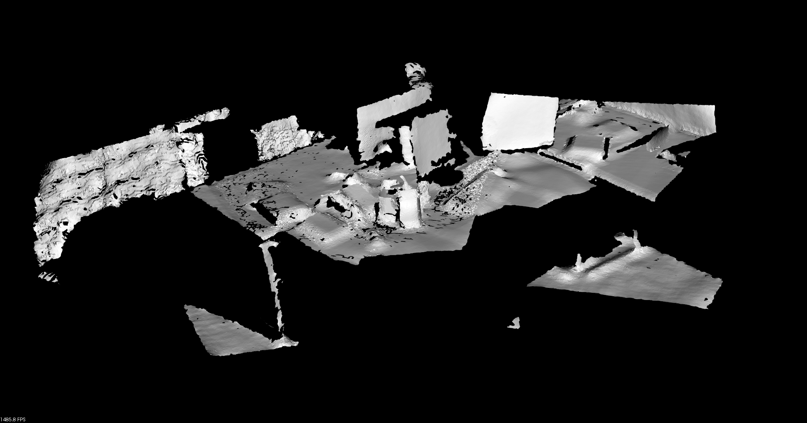

# 题目
## 给定输入点云，结合之前的内容对点云进行滤波、平滑，并计算法线，最后用贪心投影三角化方法进行网格化，显示出网格化结果。

```C++
/****************************
 * 题目：给定一个稠密的点云，结合前面的练习，对其进行如下操作：
 * 下采样和滤波、重采样平滑、法线计算，贪心投影网格化（请提供结果的截图）。
 *
* 本程序学习目标：
 * 熟悉PCL网格化流程。
 *
 * 公众号：计算机视觉life。发布于公众号旗下知识星球：从零开始学习SLAM
 * 时间：2019.01
****************************/
#include <pcl/point_types.h>
#include <pcl/io/io.h>
#include <pcl/io/pcd_io.h>
#include <pcl/visualization/cloud_viewer.h>
#include <pcl/filters/radius_outlier_removal.h>
#include <pcl/filters/voxel_grid.h>
#include <pcl/filters/statistical_outlier_removal.h>
#include <pcl/surface/mls.h>
#include <pcl/features/normal_3d.h>
#include <pcl/surface/gp3.h>
#include <pcl/surface/poisson.h>
typedef pcl::PointXYZ PointT;

int main(int argc, char** argv)
{

	// Load input file
	pcl::PointCloud<PointT>::Ptr cloud(new pcl::PointCloud<PointT>);
    pcl::PointCloud<PointT>::Ptr cloud_downSampled(new pcl::PointCloud<PointT>);
	pcl::PointCloud<PointT>::Ptr cloud_filtered(new pcl::PointCloud<PointT>);
	pcl::PointCloud<PointT>::Ptr cloud_smoothed(new pcl::PointCloud<PointT>);
	if (pcl::io::loadPCDFile("./data/fusedCloud.pcd", *cloud) == -1)
    {
        cout << "点云数据读取失败！" << endl;
    }

    std::cout << "Orginal points number: " << cloud->points.size() << std::endl;

   	// ----------------------开始你的代码--------------------------//
	// 请参考之前文章中点云下采样，滤波、平滑等内容，以及PCL官网实现以下功能。代码不难。

    pcl::VoxelGrid<PointT> downSampled; //创建滤波对象
    downSampled.setInputCloud (cloud); //设置需要过滤的点云给滤波对象
    downSampled.setLeafSize (0.01f, 0.01f, 0.01f); //设置滤波时创建的体素体积为1cm的立方体
    downSampled.filter (*cloud_downSampled); //执行滤波处理，存储输出
    pcl::io::savePCDFile ("./downsampledPC.pcd", *cloud_downSampled);
    // 统计滤波
    pcl::StatisticalOutlierRemoval<PointT> statisOutlierRemoval; //创建滤波器对象
    statisOutlierRemoval.setInputCloud (cloud_downSampled); //设置待滤波的点云
    statisOutlierRemoval.setMeanK (50); //设置在进行统计时考虑查询点临近点数
    statisOutlierRemoval.setStddevMulThresh (3.0); //设置判断是否为离群点的阀值:均值+1.0*标准差
    statisOutlierRemoval.filter (*cloud_filtered); //滤波结果存储到cloud_filtered
    pcl::io::savePCDFile ("./filteredPC.pcd", *cloud_filtered);
    // 对点云重采样
    pcl::search::KdTree<PointT>::Ptr treeSampling (new pcl::search::KdTree<PointT>); // 创建用于最近邻搜索的KD-Tree
    pcl::PointCloud<PointT> mls_points; //输出MLS
    pcl::MovingLeastSquares<PointT, PointT> mls; // 定义最小二乘实现的对象mls
    mls.setComputeNormals (false); //设置在最小二乘计算中是否需要存储计算的法线
    mls.setInputCloud (cloud_filtered); //设置待处理点云
    mls.setPolynomialOrder(2); // 拟合2阶多项式拟合
    mls.setPolynomialFit (false); // 设置为false可以 加速 smooth
    mls.setSearchMethod (treeSampling); // 设置KD-Tree作为搜索方法
    mls.setSearchRadius (0.05); // 单位m.设置用于拟合的K近邻半径
    mls.process (mls_points); //输出
    // mls结果转化为pointcloud
    pcl::PCLPointCloud2 tmp;
    pcl::toPCLPointCloud2(mls_points, tmp);
    pcl::fromPCLPointCloud2(tmp,*cloud_smoothed);
    pcl::io::savePCDFile ("./resampledPC.pcd", mls_points);
    std::cout << "Points number after filtering and resampling: " << cloud_smoothed->points.size() << std::endl;
    // 法线估计
    pcl::NormalEstimation<PointT, pcl::Normal> normalEstimation; //创建法线估计的对象
    normalEstimation.setInputCloud(cloud_smoothed); //输入点云
    pcl::search::KdTree<PointT>::Ptr tree(new pcl::search::KdTree<PointT>); // 创建用于最近邻搜索的KD-Tree
    normalEstimation.setSearchMethod(tree);
    pcl::PointCloud<pcl::Normal>::Ptr normals (new pcl::PointCloud<pcl::Normal>); // 定义输出的点云法线
    // K近邻确定方法，使用k个最近点，或者确定一个以r为半径的圆内的点集来确定都可以，两者选1即可
    normalEstimation.setKSearch(10); // 使用当前点周围最近的10个点
    //normalEstimation.setRadiusSearch(0.03); //对于每一个点都用半径为3cm的近邻搜索方式
    normalEstimation.compute(*normals); //计算法线
    // 将点云位姿、颜色、法线信息连接到一起
    pcl::PointCloud<pcl::PointNormal>::Ptr cloud_with_normals(new
                                                                      pcl::PointCloud<pcl::PointNormal>);
    pcl::concatenateFields(*cloud_smoothed, *normals, *cloud_with_normals);
    pcl::PolygonMesh mesh; //存储最终三角化的网络模型
    //定义搜索树对象
    pcl::search::KdTree<pcl::PointNormal>::Ptr tree2(new
                                                             pcl::search::KdTree<pcl::PointNormal>);
    tree2->setInputCloud(cloud_with_normals);
    // 贪心投影三角化
    pcl::GreedyProjectionTriangulation<pcl::PointNormal> gp3; // 定义三角化对象

    // 设置三角化参数
    gp3.setSearchRadius(0.1); //设置搜索时的半径，也就是KNN的球半径
    gp3.setMu (2.5); //设置样本点搜索其近邻点的最远距离为2.5倍（典型值2.5-3），这样使得算法自适应点云密度的变化
    gp3.setMaximumNearestNeighbors (100); //设置样本点最多可搜索的邻域个数，典型值是50-100
    gp3.setMinimumAngle(M_PI/18); // 设置三角化后得到的三角形内角的最小的角度为10
    gp3.setMaximumAngle(2*M_PI/3); // 设置三角化后得到的三角形内角的最大角度为120
    gp3.setMaximumSurfaceAngle(M_PI/4); // 设置某点法线方向偏离样本点法线的最大角度45，如果超过，连接时不考虑该点
    gp3.setNormalConsistency(true); //设置该参数保证法线朝向一致，设置为false的话不会进行法线一致性检查
    gp3.setInputCloud (cloud_with_normals); //设置输入点云为有向点云
    gp3.setSearchMethod (tree2); //设置搜索方式
    gp3.reconstruct (mesh); //重建提取三角化

	// ----------------------结束你的代码--------------------------//

    // 显示网格化结果
    boost::shared_ptr<pcl::visualization::PCLVisualizer> viewer(new pcl::visualization::PCLVisualizer("3D Viewer"));
    viewer->setBackgroundColor(0, 0, 0);  //
    viewer->addPolygonMesh(mesh, "mesh");  //
    while (!viewer->wasStopped())
    {
    	viewer->spinOnce(100);
    	boost::this_thread::sleep(boost::posix_time::microseconds(100000));
    }
    return 1;
}


```