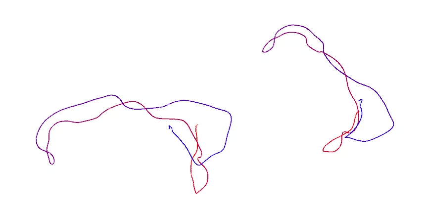

# 题目
## 给定一个轨迹１，数据格式：timestamp tx ty tz qx qy qz qw， 自定义一个任意的旋转矩阵和平移向量（可以尝试不同的值，甚至加一些噪声看看结果有什么变化），对轨迹１进行变换，得到一个新的轨迹２， 使用ICP算法（提示：取平移作为三维空间点）估计轨迹１，２之间的位姿，然后将该位姿作用在轨迹２。
## 验证：ICP算法估计的旋转矩阵和平移向量是否准确；轨迹１，２是否重合。
## 如下是我加了一个旋转平移量后的两个轨迹，经过ICP计算好位姿后再反作用在变换后的轨迹，最终两个轨迹是重合滴！

```C++
/****************************
 * 题目：给定一个轨迹１，数据格式：timestamp tx ty tz qx qy qz qw
 * 自定义一个任意的旋转矩阵和平移向量（可以尝试不同的值看看结果有什么变化），对轨迹１进行变换，得到一个新的轨迹２
 * 使用ICP算法（提示：取平移作为三维空间点）估计轨迹１，２之间的位姿，然后将该位姿作用在轨迹２
 * 验证：ICP算法估计的旋转矩阵和平移向量是否准确；轨迹１，２是否重合
 * 
* 本程序学习目标：
 * 熟悉ICP算法的原理及应用。
 *
 * 公众号：计算机视觉life。发布于公众号旗下知识星球：从零开始学习SLAM，参考答案请到星球内查看。
 * 时间：2019.05
 * 作者：小六
****************************/
#include <iostream>
#include "sophus/se3.hpp"
#include <fstream>
#include <pangolin/pangolin.h>
#include <opencv2/core/core.hpp>
#include <opencv2/calib3d/calib3d.hpp>
#include <Eigen/Core>
#include <Eigen/Geometry>
#include <Eigen/SVD>

using namespace std;
using namespace cv;

void DrawTrajectory(vector<Sophus::SE3d, Eigen::aligned_allocator<Sophus::SE3d>> pose1,
                    vector<Sophus::SE3d, Eigen::aligned_allocator<Sophus::SE3d>> pose2);
void pose_estimation_3d3d (
        const vector<Point3f>& pts1,
        const vector<Point3f>& pts2,
        Eigen::Matrix3d& R_, Eigen::Vector3d& t_
);


int main() {
    // path to trajectory file
    string trajectory_file = "../trajectory.txt";


    vector<Sophus::SE3d, Eigen::aligned_allocator<Sophus::SE3d>> pose_groundtruth;
    vector<Sophus::SE3d, Eigen::aligned_allocator<Sophus::SE3d>> pose_new;
    vector<Sophus::SE3d, Eigen::aligned_allocator<Sophus::SE3d>> pose_estimate;
    vector<Point3f> pts_new, pts_groundtruth;

    Eigen::Quaterniond q;
    Eigen::Vector3d t;
    Sophus::SE3d T;
    string timestamp;
    ifstream textFile;

    // 自定义一个变换矩阵
    /**********************　开始你的代码，参考星球里作业５代码　****************************/
    // 旋转向量（轴角）：沿Z轴旋转45°
    Eigen::AngleAxisd rotation_vector(M_PI / 4, Eigen::Vector3d(0, 0, 1));
    Eigen::Quaterniond rotate(rotation_vector);
    // 平移向量，可以自己自定义，我这里是 x=3, y=-1, z=0.8，可以多尝试其他值
    Eigen::Vector3d tranlation = Eigen::Vector3d(3, -1, 0.8);
    /**********************　结束你的代码　****************************/

    Sophus::SE3d myTransform(rotate, tranlation);
    cout << "rotation matrix =\n" << rotation_vector.matrix() << endl;
    cout << "translation vector =\n" << tranlation << endl;
    cout << "myTransform =\n" << myTransform.matrix() << endl;

    textFile.open(trajectory_file.c_str());

    //　读取轨迹数据
    /**********************　开始你的代码，参考星球里作业８代码　****************************/
    // 提示：取平移作为三维空间点
    if (!textFile.is_open()) {
        cout << "file is empty!" << endl;
        return -1;
    } else {
        string sLineData;
        while ((getline(textFile, sLineData)) && !sLineData.empty()) {
            istringstream strData(sLineData);
            strData >> timestamp >> t[0] >> t[1] >> t[2] >> q.x() >> q.y() >> q.z() >> q.w();
            if ((timestamp == "#") || (timestamp == "-1.#INF")) {  // 异常处理
                continue;
            }

            T = Sophus::SE3d(q, t);
            pose_groundtruth.push_back(T);          //pose
            pts_groundtruth.push_back(Point3f(t[0], t[1], t[2]));  // points

            Sophus::SE3d Tmp(myTransform * T);
            pose_new.push_back(Tmp);   //new pose
            pts_new.push_back(Point3f(Tmp.translation()[0], Tmp.translation()[1], Tmp.translation()[2])); // new points

        }

    }
    /**********************　结束你的代码　****************************/
    textFile.close();


    // 使用ICP算法估计轨迹１，２之间的位姿，然后将该位姿作用在轨迹２
    /**********************　开始你的代码，参考十四讲中第７章ICP代码　****************************/
    Eigen::Matrix3d R_;
    Eigen::Vector3d t_;
    pose_estimation_3d3d(pts_new, pts_groundtruth, R_, t_);
    cout << "Estimated results from ICP: " << endl;

    cout << "Estimated rotation matrix =\n" << R_ << endl;
    cout << "Estimated translation vector =\n" << t_ << endl;
    //取逆
    Eigen::Matrix3d Rot = R_.inverse();
    Eigen::Vector3d tran = -Rot * t_;
    Sophus::SE3d T_estimate(Rot, tran);  // pose_groundtruth =  T_estimate* pose_new


    for (int i = 0; i < pose_new.size(); i++) {
        pose_estimate.push_back(T_estimate * pose_new[i]);
        /**********************　结束你的代码　****************************/

        //DrawTrajectory(pose_groundtruth, pose_new);  // 变换前的两个轨迹
        DrawTrajectory(pose_groundtruth, pose_estimate);  // 轨迹应该是重合的
        return 0;
    }
}

// 参数(p1,p2,R,t), 即P1 = R×P2 + t;
    void pose_estimation_3d3d (
            const vector<Point3f>& pts1,
            const vector<Point3f>& pts2,
            Eigen::Matrix3d& R_, Eigen::Vector3d& t_
    )
    {
        Point3f p1, p2;     // center of mass
        int N = pts1.size();
        for ( int i=0; i<N; i++ )
        {
            p1 += pts1[i];
            p2 += pts2[i];
        }
        p1 = Point3f( p1 /  N);
        p2 = Point3f( p2 / N);
        vector<Point3f>     q1 ( N ), q2 ( N ); // remove the center
        for ( int i=0; i<N; i++ )
        {
            q1[i] = pts1[i] - p1;
            q2[i] = pts2[i] - p2;
        }

        // compute q1*q2^T
        Eigen::Matrix3d W = Eigen::Matrix3d::Zero();
        for ( int i=0; i<N; i++ )
        {
            W = W+ Eigen::Vector3d ( q1[i].x, q1[i].y, q1[i].z ) * Eigen::Vector3d ( q2[i].x, q2[i].y, q2[i].z ).transpose();
        }
//    cout<<"W="<<W<<endl;

        // SVD on W
        Eigen::JacobiSVD<Eigen::Matrix3d> svd ( W, Eigen::ComputeFullU|Eigen::ComputeFullV );
        Eigen::Matrix3d U = svd.matrixU();
        Eigen::Matrix3d V = svd.matrixV();

        if (U.determinant() * V.determinant() < 0)
        {
            for (int x = 0; x < 3; ++x)
            {
                U(x, 2) *= -1;
            }
        }

//    cout<<"U="<<U<<endl;
//    cout<<"V="<<V<<endl;

        R_ = U* ( V.transpose() );
        t_ = Eigen::Vector3d ( p1.x, p1.y, p1.z ) - R_ * Eigen::Vector3d ( p2.x, p2.y, p2.z );
    }

void DrawTrajectory(vector<Sophus::SE3d, Eigen::aligned_allocator<Sophus::SE3d>> pose1,
                    vector<Sophus::SE3d, Eigen::aligned_allocator<Sophus::SE3d>> pose2) {
    if (pose1.empty()||pose2.empty()) {
        cerr << "Trajectory is empty!" << endl;
        return;
    }

    // create pangolin window and plot the trajectory
    pangolin::CreateWindowAndBind("Trajectory Viewer", 1024, 768);
    glEnable(GL_DEPTH_TEST);
    glEnable(GL_BLEND);
    glBlendFunc(GL_SRC_ALPHA, GL_ONE_MINUS_SRC_ALPHA);

    pangolin::OpenGlRenderState s_cam(
            pangolin::ProjectionMatrix(1024, 768, 500, 500, 512, 389, 0.1, 1000),
            pangolin::ModelViewLookAt(0, -0.1, -1.8, 0, 0, 0, 0.0, -1.0, 0.0)
    );

    pangolin::View &d_cam = pangolin::CreateDisplay()
            .SetBounds(0.0, 1.0, pangolin::Attach::Pix(175), 1.0, -1024.0f / 768.0f)
            .SetHandler(new pangolin::Handler3D(s_cam));


    while (pangolin::ShouldQuit() == false) {
        glClear(GL_COLOR_BUFFER_BIT | GL_DEPTH_BUFFER_BIT);

        d_cam.Activate(s_cam);
        glClearColor(1.0f, 1.0f, 1.0f, 1.0f);

        glLineWidth(2);
        for (size_t i = 0; i < pose1.size() - 1; i++) {
            glColor3f(1 - (float) i / pose1.size(), 0.0f, (float) i / pose1.size());
            glBegin(GL_LINES);
            auto p1 = pose1[i], p2 = pose1[i + 1];
            glVertex3d(p1.translation()[0], p1.translation()[1], p1.translation()[2]);
            glVertex3d(p2.translation()[0], p2.translation()[1], p2.translation()[2]);
            glEnd();
        }
        for (size_t i = 0; i < pose2.size() - 1; i++) {
            glColor3f(1 - (float) i / pose2.size(), 0.0f, (float) i / pose2.size());
            glBegin(GL_LINES);
            auto p1 = pose2[i], p2 = pose2[i + 1];
            glVertex3d(p1.translation()[0], p1.translation()[1], p1.translation()[2]);
            glVertex3d(p2.translation()[0], p2.translation()[1], p2.translation()[2]);
            glEnd();
        }

        pangolin::FinishFrame();
        //usleep(5000);   // sleep 5 ms
    }
}
```