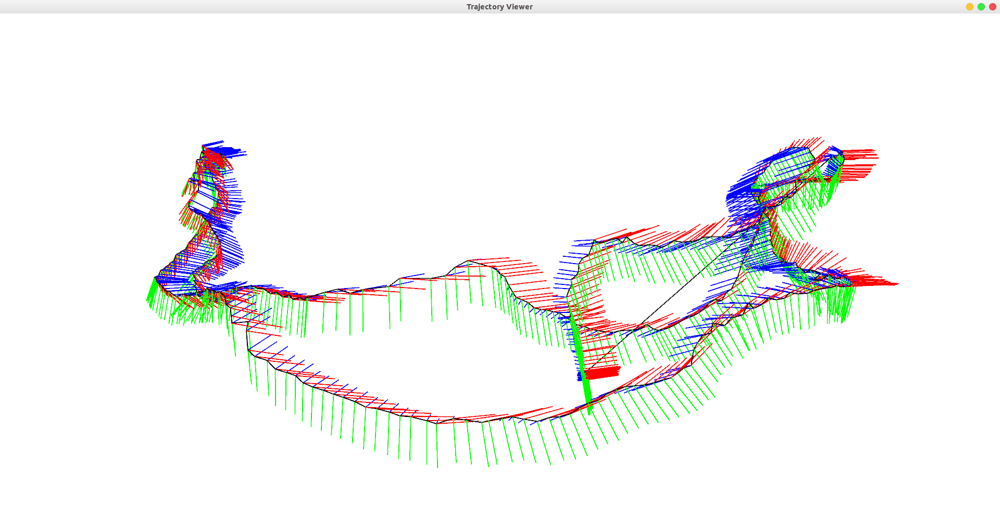

# SLAM问题的目标之一就是精确的估计相机运动的轨迹（姿态），如果我们将相机运动的轨迹绘制出来，就可以直观的观察它的运动是否符合预期。给定一个轨迹文件trajectory.txt，该文件的每一行由若干个数据组成，格式为 [time, tx, ty, tz, qx, qy, qz, qw],其中 time 为时间，tx,ty,tz 为平移部分，qx,qy,qz,qw 是四元数表示的旋转部分，请完成数据读取部分的代码，绘制部分代码已经给出。

```C++
/****************************
 * 题目：SLAM问题的目标之一就是精确的估计相机运动的轨迹（姿态），如果我们将相机运动的轨迹绘制出来，就可以直观的观察它的运动是否符合预期。
 * 给定一个轨迹文件trajectory.txt，该文件的每一行由若干个数据组成，格式为 [time, tx, ty, tz, qx, qy, qz, qw],
 * 其中 time 为时间，tx,ty,tz 为平移部分，qx,qy,qz,qw 是四元数表示的旋转部分，请完成数据读取部分的代码，绘制部分代码已经给出。
 *
* 本程序学习目标：
 * 熟悉李代数库Sophus安装及基本操作
 * 熟悉数据流读取基本操作
 * 需要安装pangolin，注意异常数据处理
 *
 * 公众号：计算机视觉life。发布于公众号旗下知识星球：从零开始学习SLAM
 * 时间：2018.10
****************************/

#include <sophus/se3.hpp>
#include <string>
#include <iostream>
#include <fstream>
#include <pangolin/pangolin.h>
#include <Eigen/Core>
#include <unistd.h>

using namespace std;
using namespace Eigen;

// path to trajectory file
string trajectory_file = "./trajectory.txt";
void DrawTrajectory(vector<Isometry3d, Eigen::aligned_allocator<Isometry3d>>);

int main(int argc, char **argv) {

    vector<Isometry3d, Eigen::aligned_allocator<Isometry3d>> poses;

    /// implement pose reading code
    // 开始你的代码
    ifstream fin(trajectory_file);
    if (!fin) {
        cout << "cannot find trajectory file at " << trajectory_file << endl;
        return 1;
    }
    string str;

    while (!fin.eof()) {
        double  tx, ty, tz, qx, qy, qz, qw;
        string time;
        //fin >> time >> tx >> ty >> tz >> qx >> qy >> qz >> qw;

        getline(fin, str);
        cout << "str = " << str << endl;
        if (str.at(0) == '#'){
            continue;
        }
        istringstream is(str);
        is >> time >> tx >> ty >> tz >> qx >> qy >> qz >> qw;
        cout << time << " " << tx << " " << ty << " " << tz << " "
             << qx << " " << qy<< " " << qz << " " << qw << endl;
        if (time == "-1.#INF"){
            cout << "WARN: INF ERROR" << endl;
            continue;
        }

        Isometry3d Twr(Quaterniond(qw, qx, qy, qz));
        Twr.pretranslate(Vector3d(tx, ty, tz));
        poses.push_back(Twr);
    }
    cout << "read total " << poses.size() << " pose entries" << endl;

    // 结束你的代码

    // draw trajectory in pangolin
    DrawTrajectory(poses);
    return 0;
}

// 无需改动以下绘图程序
void DrawTrajectory(vector<Isometry3d, Eigen::aligned_allocator<Isometry3d>> poses) {
    // create pangolin window and plot the trajectory
    pangolin::CreateWindowAndBind("Trajectory Viewer", 1024, 768);
    glEnable(GL_DEPTH_TEST);
    glEnable(GL_BLEND);
    glBlendFunc(GL_SRC_ALPHA, GL_ONE_MINUS_SRC_ALPHA);

    pangolin::OpenGlRenderState s_cam(
            pangolin::ProjectionMatrix(1024, 768, 500, 500, 512, 389, 0.1, 1000),
            pangolin::ModelViewLookAt(0, -0.1, -1.8, 0, 0, 0, 0.0, -1.0, 0.0)
    );

    pangolin::View &d_cam = pangolin::CreateDisplay()
            .SetBounds(0.0, 1.0, 0.0, 1.0, -1024.0f / 768.0f)
            .SetHandler(new pangolin::Handler3D(s_cam));

    while (pangolin::ShouldQuit() == false) {
        glClear(GL_COLOR_BUFFER_BIT | GL_DEPTH_BUFFER_BIT);
        d_cam.Activate(s_cam);
        glClearColor(1.0f, 1.0f, 1.0f, 1.0f);
        glLineWidth(2);
        for (size_t i = 0; i < poses.size(); i++) {
            // 画每个位姿的三个坐标轴
            Vector3d Ow = poses[i].translation();
            Vector3d Xw = poses[i] * (0.1 * Vector3d(1, 0, 0));
            Vector3d Yw = poses[i] * (0.1 * Vector3d(0, 1, 0));
            Vector3d Zw = poses[i] * (0.1 * Vector3d(0, 0, 1));
            glBegin(GL_LINES);
            glColor3f(1.0, 0.0, 0.0);
            glVertex3d(Ow[0], Ow[1], Ow[2]);
            glVertex3d(Xw[0], Xw[1], Xw[2]);
            glColor3f(0.0, 1.0, 0.0);
            glVertex3d(Ow[0], Ow[1], Ow[2]);
            glVertex3d(Yw[0], Yw[1], Yw[2]);
            glColor3f(0.0, 0.0, 1.0);
            glVertex3d(Ow[0], Ow[1], Ow[2]);
            glVertex3d(Zw[0], Zw[1], Zw[2]);
            glEnd();
        }
        // 画出连线
        for (size_t i = 0; i < poses.size(); i++) {
            glColor3f(0.0, 0.0, 0.0);
            glBegin(GL_LINES);
            auto p1 = poses[i], p2 = poses[i + 1];
            glVertex3d(p1.translation()[0], p1.translation()[1], p1.translation()[2]);
            glVertex3d(p2.translation()[0], p2.translation()[1], p2.translation()[2]);
            glEnd();
        }
        pangolin::FinishFrame();
        usleep(5000);   // sleep 5 ms
    }
}
```