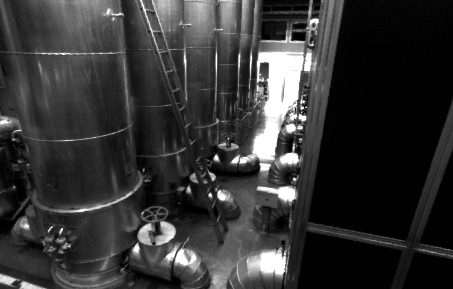

# 题目
## 相机视场角比较小（比如手机摄像头）时，一般可以近似为针孔相机成像，三维世界中的直线成像也是直线。但是很多时候需要用到广角甚至鱼眼相机，此时会产生畸变，三维世界中的直线在图像里会弯曲。因此，需要做去畸变。 本题给定一张广角畸变图像，以及相机的内参，请完成图像去畸变过程。


```C++
#include <opencv2/opencv.hpp>
#include <string>

using namespace std;

string image_file = "./imageBasics/distorted.png";   // 请确保路径正确

int main(int argc, char **argv) {

  // 本程序实现去畸变部分的代码。尽管我们可以调用OpenCV的去畸变，但自己实现一遍有助于理解。
  // 畸变参数
  double k1 = -0.28340811, k2 = 0.07395907, p1 = 0.00019359, p2 = 1.76187114e-05;
  // 内参
  double fx = 458.654, fy = 457.296, cx = 367.215, cy = 248.375;

  cv::Mat image = cv::imread(image_file, 0);   // 图像是灰度图，CV_8UC1
  int rows = image.rows, cols = image.cols;
  cv::Mat image_undistort = cv::Mat(rows, cols, CV_8UC1);   // 去畸变以后的图

  // 计算去畸变后图像的内容
  for (int v = 0; v < rows; v++) {
    for (int u = 0; u < cols; u++) {
      // 按照公式，计算点(u,v)对应到畸变图像中的坐标(u_distorted, v_distorted)
      double x = (u - cx) / fx, y = (v - cy) / fy;
      double r = sqrt(x * x + y * y);
      double x_distorted = x * (1 + k1 * r * r + k2 * r * r * r * r) + 2 * p1 * x * y + p2 * (r * r + 2 * x * x);
      double y_distorted = y * (1 + k1 * r * r + k2 * r * r * r * r) + p1 * (r * r + 2 * y * y) + 2 * p2 * x * y;
      double u_distorted = fx * x_distorted + cx;
      double v_distorted = fy * y_distorted + cy;

      // 赋值 (最近邻插值)
      if (u_distorted >= 0 && v_distorted >= 0 && u_distorted < cols && v_distorted < rows) {
        image_undistort.at<uchar>(v, u) = image.at<uchar>((int) v_distorted, (int) u_distorted);
      } else {
        image_undistort.at<uchar>(v, u) = 0;
      }
    }
  }

  // 画图去畸变后图像
  cv::imshow("distorted", image);
  cv::imshow("undistorted", image_undistort);
  cv::waitKey();
  return 0;
}

```